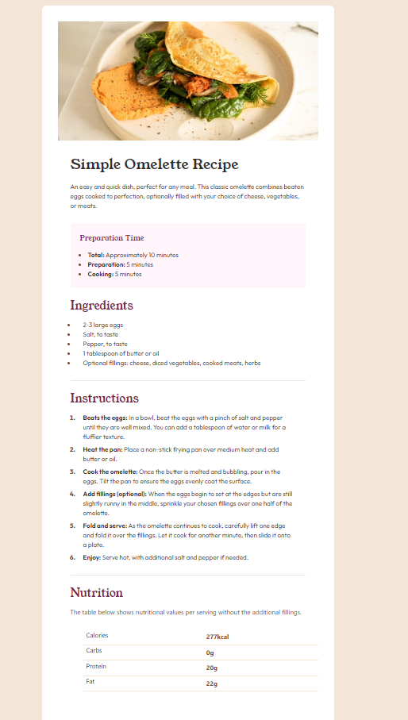

# Frontend Mentor - Recipe page solution

This is a solution to the [Recipe page challenge on Frontend Mentor](https://www.frontendmentor.io/challenges/recipe-page-KiTsR8QQKm). Frontend Mentor challenges help you improve your coding skills by building realistic projects. 

## Table of contents

- [Overview](#overview)
  - [Screenshot](#screenshot)
  - [Links](#links)
- [My process](#my-process)
  - [Built with](#built-with)

## Overview

### Screenshot

### Links

- Solution URL: [FrontendMentor](https://www.frontendmentor.io/solutions/recipepage--htmlcsstailwindcss-RdtFM9DRs0)
- Live Site URL: [GitHub Page](https://palorobe.github.io/FrontendMentore-RecipePage/)

## My process

### Built with

- Semantic HTML5 markup
- CSS custom properties
- Mobile-first workflow
- [Tailwind Css](https://tailwindcss.com/) 

